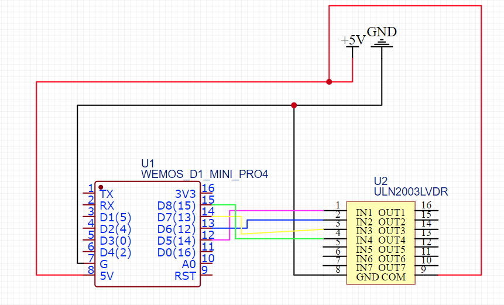
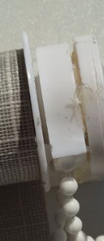
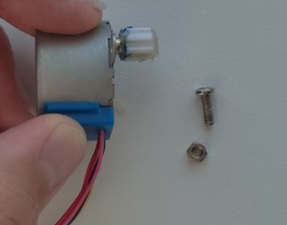
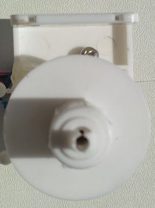
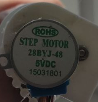
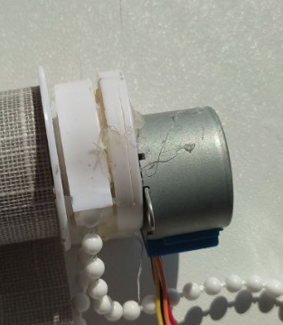

# AutoRoll - control your roller blinds by WiFi
## Video: https://youtu.be/U_YfX8vU8Tc

# Tutorial
You need: ESP8266 (wemos d1 mini), ULN2003, 28BYJ-48 5VDC stepper, some glue, screw and nut
## Software
1. connect
   
2. Flash your esp8266 with espruino (https://www.espruino.com/ESP8266_Flashing)
3. modify src/main.js 
   - Change:
     - wifi_Password = your wifi password
     - wifi_name = your wifi name
     - fullWindowSteps = 460*height of your windows in centimeter
4. run `npm run uglify` in project dir
5. run espruino ide and open index.js
6. change upload destination to "flash"
7. click on upload button
8. Enjoy!

## Hardware
1. Disassemble your blinds
2. find detail with chain

3. modify it by connecting detail input with motor output

4. attach the motor to the detail

5. Glue arc-like detail to the base

6. Assemble blinds
7. Enjoy!

# HTTP Documentation:
## 1. GET; HEADERS: MOVE=INT
int move - a number indicating the number of steps of a stepper 